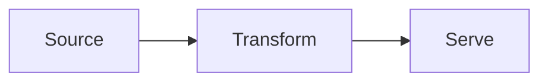

This is sample content. Replace the frontmatter and body with your own writing when you are ready to publish.

## Markdown basics

You can use standard Markdown here, including headings, lists, code blocks, and Mermaid diagrams.

### Lists

Bulleted list:

- First item
- Second item with a bit more detail
- Third item

Numbered list:

1. Plan the change
2. Ship a small slice
3. Measure and iterate

### Code

Python:

```python
from dataclasses import dataclass


@dataclass
class Record:
    id: int
    name: str


def main() -> None:
    rows = [Record(1, "alpha"), Record(2, "beta")]
    for row in rows:
        print(f"{row.id}: {row.name}")


if __name__ == "__main__":
    main()
```

Go:

```go
package main

import "fmt"

type Record struct {
	ID   int
	Name string
}

func main() {
	rows := []Record{
		{ID: 1, Name: "alpha"},
		{ID: 2, Name: "beta"},
	}

	for _, row := range rows {
		fmt.Printf("%d: %s\n", row.ID, row.Name)
	}
}
```

### Diagram


