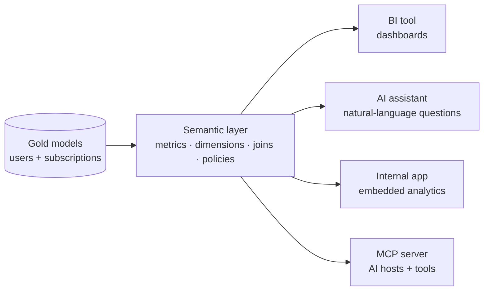
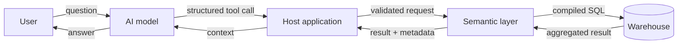

## What is a semantic layer?

A semantic layer is a shared translation layer between trusted data models and the people and tools that use them. It describes business concepts, including metrics, dimensions, entities, relationships, and sometimes access rules, in a form that different clients can query consistently.

The goal is to define a metric once and reuse it everywhere. If an active subscriber means a distinct user with an active subscription, that definition should not be recreated independently in every dashboard, application, and AI assistant.

A semantic layer sits logically between modeled warehouse data and the tools that consume it. The warehouse stores and computes over data, while tools such as [dbt](https://docs.getdbt.com/) build modeled tables and apply data quality tests. The semantic layer describes how those models should be joined, filtered, grouped, and aggregated.

Implementations vary: some are part of a BI platform, some are warehouse-native, and some are headless services shared by many clients.

## A small example

Here is a simplified [Cube-style](https://docs.cube.dev/docs/data-modeling/overview) example focused on the concepts rather than implementation details. Other tools use different syntax, but the same concepts apply: lay out your tables and fields, define reusable measures, and make their relationships explicit.

```yaml
cubes:
  - name: users
    sql_table: gold.dim_users
    dimensions:
      - name: id
        sql: id
        type: string
        primary_key: true
      - name: region
        sql: region
        type: string

  - name: subscriptions
    sql_table: gold.fct_subscription_snapshots
    joins:
      - name: users
        sql: "user_id = users.id"
        relationship: many_to_one
    measures:
      - name: active_subscribers
        sql: user_id
        type: count_distinct
        filters:
          - sql: "status = 'active'"
      - name: monthly_recurring_revenue
        sql: monthly_recurring_revenue
        type: sum
    dimensions:
      - name: id
        sql: id
        type: string
        primary_key: true
      - name: user_id
        sql: user_id
        type: string
      - name: started_at
        sql: started_at
        type: time
      - name: snapshot_month
        sql: snapshot_month
        type: time
```

In this example, `fct_subscription_snapshots` has one row per subscription per month, and `snapshot_month` is the reporting period. A measure is a number to calculate and a dimension is a way to group or filter it. A client can request active subscribers by region and month without knowing the underlying tables, joins, or aggregation logic. The primary-key dimensions are important because Cube uses them to prevent fanouts from inflating measures when cubes are joined, as described in [Cube's join documentation](https://docs.cube.dev/docs/data-modeling/joins).

If the source table instead has one row per subscription, an “active as of” metric needs start/end-date logic or a snapshot model; a simple `status = 'active'` filter does not define historical membership by itself.

That makes it possible to reuse the same definitions across dashboards, applications, and assistants instead of creating a new model for every question. It does not, however, make an incorrect definition or bad upstream data correct.

For example, a user could ask:

- How many active subscribers do we have this month, by region?
- How did month-end monthly recurring revenue change compared with last month and the same month last year?
- What is the churn rate? If churn is not defined, the assistant should ask which definition and reporting window to use.

## Why this matters for AI

Dashboards are useful, but they require people to find the right report, interpret it, and notice the relevant patterns. A conversational assistant can make that interaction easier by letting someone ask a question in ordinary language and follow up on the answer.

Giving an LLM unrestricted access to the raw database is a poor way to do this. Even read-only access could expose sensitive data, run expensive queries, or produce answers from tables whose meaning is unclear.

A semantic layer gives the LLM a smaller and more constrained surface to use: approved metrics, dimensions, relationships, and filters, plus whatever query limits the application or semantic service enforces. The assistant can request a business concept such as `active_subscribers`; the service can validate and compile a structured query from the approved model instead of having the model invent SQL against raw tables.

The semantic layer does not replace BI tools or the warehouse. It adds a governed interface that can be shared by BI dashboards, scheduled reports, applications, and LLM-powered assistants.

## What it enables

Governed semantic models can support:

- BI dashboards and ad-hoc exploration.
- Natural-language analytics assistants.
- Analytics inside internal or customer-facing applications.
- MCP integrations for AI hosts and developer tools.

[MCP](https://modelcontextprotocol.io/specification/draft/server/tools) is an open interface protocol, not a semantic layer. An MCP server can expose tools that search a semantic catalog or request metrics, allowing compatible clients to use the governed model without learning the warehouse schema.



Semantic layers aren't a prerequisite for natural-language agentic workflows, but they provide a flexible foundation for them. Users can ask questions naturally while the system works with approved metrics, relationships, and policies.

## From question to answer

A model cannot discover a semantic layer unless the host application exposes catalog metadata or tools. Those tools are small, described functions with defined inputs, such as:

- A discovery tool for metric and dimension names and descriptions.
- A query tool for metrics, dimensions, filters, and time ranges.
- A definition or validation tool for explaining calculations and supported requests.

These capabilities can be provided as separate tools, one structured query tool, catalog context, or an MCP server. The important part is that the supported query surface is explicit and discoverable.

For “How many active subscribers do we have this month by region?”, the flow looks like this:

1. The model identifies the metric, dimension, and time filter, then checks the available definition.
2. It sends a structured tool call for `active_subscribers`, grouped by `region` and filtered to the current month on `snapshot_month`.
3. Trusted application code (such as a REST API) validates the request & authorization, and forwards it to the semantic layer.
4. The semantic layer applies any configured policies, compiles the request into warehouse SQL, and returns structured results to the application, which passes them along to the LLM. The LLM then interprets the results and generates a natural-language answer for the user.



The application and/or semantic service should reject unsupported metrics, unauthorized dimensions, invalid filters, and excessive requests. If no defined metric answers the question, the system should ask for clarification or say “not supported,” not guess at SQL.

## What a semantic layer does not solve

A semantic layer improves the interface to data, but it does not remove the need for engineering discipline.

- **Business definitions still need owners.** Someone must decide what “customer,” “active,” “revenue,” and “churn” mean.
- **Data still needs to be modeled.** Valid transformations, tests, and relationships need to be defined and maintained to ensure accurate results.
- **Security and answer quality still need attention.** Governance around user identity, access control, and result verification remains more important than ever.
