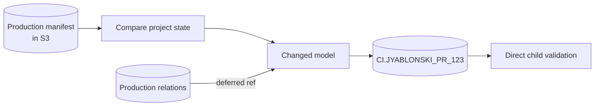
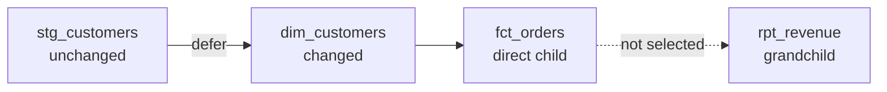
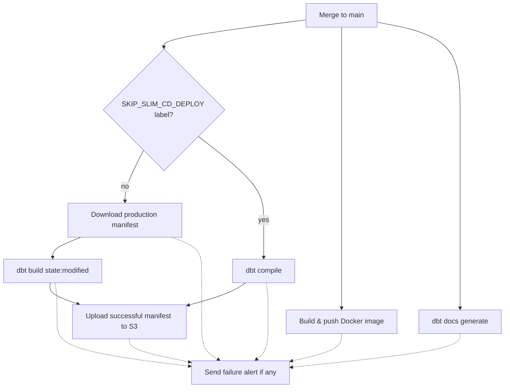

## What Is It

[Slim CI](https://docs.getdbt.com/best-practices/best-practice-workflows#run-only-modified-models-to-test-changes-slim-ci) uses a remote manifest to compare the current project with the last successful production deployment, then builds only changed resources. This can speed up CI and CD pipelines, but it needs careful setup.

After implementing it at two companies and in personal projects, I found a few practices that make it more reliable and easier to maintain but are not explicit in the dbt documentation.

## How Can It Be Used

Despite the name, Slim CI works for both CI and CD.

- In CI, it validates a pull request by building changed resources instead of the entire project.
- In CD, it uses the same process to build changed resources in production.

Both need a few things set up beforehand.

## Remote Manifest Storage

Slim CI relies on a copy of dbt's `manifest.json` in remote storage for future workflows to use as comparison state.

The manifest describes the project's resources, configuration, and dependency graph. After each successful production workflow, upload the manifest generated by `dbt build` or the compile-only skip path to remote storage such as S3 so future workflows can download the last successful state.

The [`state:modified` selector](https://docs.getdbt.com/reference/node-selection/methods#state) compares the checked-out project with this manifest across resource types. A pull request that changes only a data test selects only that test.

```sh
dbt ls --select "state:modified" --state state
```

Keep `state/` separate from dbt's `target/` directory. Otherwise, the manifest dbt writes while parsing can overwrite the baseline before comparison.

This artifact is what makes the pipeline "slim." Without it, there is nothing to diff against.

## dbt Project Changes

### Sources

A CI build still needs source data. Cloning or copying it into CI means creating, refreshing, and cleaning up those copies. Pointing CI reads at an existing database, usually production, avoids that work while keeping pull request models isolated.

`--defer` resolves unbuilt `ref()` calls to existing relations, but it does not apply to `source()`. If a source database uses `target.database`, CI points it to the CI database, where raw data does not exist. Override the `source` macro to read the production database instead:

```jinja

    
    
    

    
        
    

    

```

This lets CI models read raw data from `CI_SOURCE_DATABASE_NAME` without copying it. The override redirects only sources that would point to CI and leaves external source databases unchanged.

Keeping the database choice in this macro also lets every environment use the same source YAML and manifest, preventing unrelated `state:modified` selections.

> **Disclaimer:** This overrides a [dbt builtin](https://docs.getdbt.com/reference/dbt-jinja-functions/builtins), so cover it with compile tests and revisit it during dbt upgrades.

### Schemas

A common pattern is one CI database with a schema for each pull request, giving every pull request an isolated space for its changes.

For PR 123, the target might be:

```text
CI.JYABLONSKI_PR_123.DIM_CUSTOMERS
```

The CI target can take its schema from an environment variable:

```yaml
ci:
  type: snowflake
  database: CI
  schema: "{{ env_var('DBT_CI_SCHEMA') }}"
```

Add a CI branch to `generate_schema_name` so configured model schemas cannot escape the pull request namespace. Keep the macro's existing behavior for other targets:

```jinja

    {{ target.schema | trim }}

    {# Existing production schema logic. #}

    {# Existing development schema logic. #}

```

dbt also provides [`generate_schema_name_for_env`](https://docs.getdbt.com/docs/build/custom-schemas#a-built-in-alternative-pattern-for-generating-schema-names) when CI should ignore custom model schemas and production should honor them.

## Defer

Selection decides what dbt builds, but it does not make unselected parents available in an isolated CI schema. [`--defer`](https://docs.getdbt.com/reference/node-selection/defer) uses the saved manifest to resolve those `ref()` calls to another environment, usually production. dbt can then build selected resources in the pull request schema and reuse existing upstream relations.

If `dim_customers` changes but its parents do not, CI builds it in the pull request schema and resolves its parents to relations in the production manifest. It does not need to rebuild the full upstream graph.

Together, defer and the source override let CI read current production data for both `ref()` and `source()` dependencies without cloning or copying it. Changed models use the same inputs they will see after deployment while their output stays isolated. This means CI reads production data directly, so some teams use a masked or smaller copy instead.



## Limit Rows in CI

Defer avoids rebuilding upstream models, but a changed model can still scan hundreds of millions of production rows. A CI-only wrapper around `ref()` and `source()` can reduce that work. Common options are to apply a fixed `LIMIT` to each input or filter each input to a recent window, such as the last three days. These can be packaged into a `ref()` macro override for a specific `target`.

- A fixed limit is simple and does not need a timestamp column, but the selected rows are arbitrary unless they are ordered. Limiting inputs independently can also remove matching join keys and cause relationship or aggregate tests to fail for reasons unrelated to the change.
- A date window keeps a more consistent slice, but it needs a reliable timestamp and can miss late-arriving records, historical joins, or older dimension rows.

These are deliberate compromises. The goal in CI is to prove that a change compiles, runs, and passes useful tests without building a 500 million row table. Treat the result as fast feedback rather than proof of full-data correctness, and keep full-volume validation in production or a scheduled job.

## Implementation

With the manifest, macros, and CI database in place, the last step is selecting what to build.

### CI

Building only `state:modified` can miss breaking changes downstream. If `dim_customers` drops `customer_status` but unchanged `fct_orders` still selects it, CI succeeds and the next production run fails on `fct_orders`.

The compromise is `state:modified+1`. The [`+1` graph operator](https://docs.getdbt.com/reference/node-selection/graph-operators#the-n-plus-operator) includes changed resources and their direct descendants, catching likely compatibility breaks without rebuilding the full DAG. `state:modified+` builds everything downstream but costs more time and compute.



The CI command is:

```sh
dbt build \
  --target ci \
  --select "state:modified+1" \
  --state state \
  --defer \
  --favor-state
```

`--favor-state` matters when a pull request schema survives multiple pushes. Without it, dbt can prefer an old relation in that schema over the saved manifest. The flag makes production state the source of truth for unselected `ref()` calls.

### CD

After merge, CI has already tested changed resources with their direct children. CD only needs to build the changed resources in production.

```sh
dbt build \
  --target prod \
  --select "state:modified" \
  --state state
```

This does not need `--defer` because unchanged upstream relations already exist in production.

## Operational Guidance

### How to Skip dbt Build in CD

Some models do not belong on a GitHub Actions runner. A full refresh might take four hours or require a longer statement timeout. A protected pull request label such as `SKIP_SLIM_CD_DEPLOY` can skip the dbt build after merge. The manifest must still advance, so this path runs `dbt compile` and uploads the result to S3.

For a CD workflow triggered when a pull request closes, use a job condition like this:

```yaml
on:
  pull_request:
    types: [closed]

jobs:
  slim-cd:
    runs-on: ubuntu-latest
    if: >-
      github.event.pull_request.merged == true &&
      !contains(github.event.pull_request.labels.*.name, 'SKIP_SLIM_CD_DEPLOY')
    steps:
      # checkout, install dbt, download the production manifest, etc.
      - run: dbt build --target prod --select "state:modified" --state state
```

You can also use a step condition or a guard job that gates deployment. The key is a trusted label that makes the exception explicit and auditable.

This requires the `pull_request` event, which includes the labels. A workflow triggered by a push to `main` must first find the associated pull request.

### Clean Up PR Schemas

Each pull request leaves a schema in the CI database. A workflow that runs when the pull request closes prevents stale schemas from accumulating:

```yaml
on:
  pull_request:
    types: [closed]

jobs:
  drop-pr-schema:
    runs-on: ubuntu-latest
    env:
      PR_SCHEMA: DBT_CI_PR_${{ github.event.pull_request.number }}
    steps:
      - run: snowsql -q "DROP SCHEMA IF EXISTS CI.${PR_SCHEMA}"
```

This runs whether the pull request merged or closed without merging. Before cleanup, `--favor-state` keeps dbt from preferring stale relations.

### Diagram Example

These workflows can also run independent work in parallel, such as [dbt docs](https://docs.getdbt.com/reference/commands/cmd-docs) generation, Docker image builds, and lint or formatter checks. One possible layout is:


