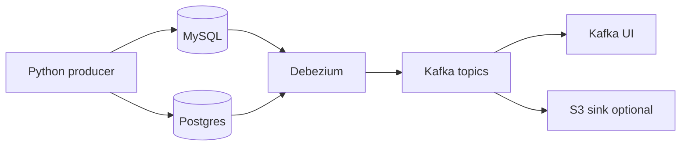

## What it is

A local change-data-capture (CDC) playground: Debezium connectors stream database changes into Kafka topics, with Kafka UI for inspection and optional S3 sink examples.

## What it does

- Spins up MySQL, Postgres, Kafka, Zookeeper, Kafka Connect, and Debezium via Docker Compose
- Registers Debezium connector configs to capture inserts, updates, and deletes on both databases
- Streams those change events into Kafka topics, one topic per source table
- Exposes the topics in Kafka UI so you can inspect events in real time
- Runs a synthetic Python producer that continuously writes rows to MySQL and Postgres, so both connectors stay busy emitting change events

The scale here is tiny, but the building blocks are the same ones you'd use in a production CDC pipeline handling thousands of times the throughput.

## Why I built it

At a past engineering role, we needed to evaluate and implement a CDC solution for our MySQL database. Building this playground let me prototype connector configs and settings on my own terms, then essentially copy the working setup into our staging environment at work without impacting it during testing.

After data lands in Kafka topics, sinks can unload it to whichever destination you want. In my case, getting this into the Data Warehouse afterwards was the end goal, and the process was trivial once the Debezium and Kafka pieces were in place.

This was pre-AI tooling, and being able to iterate independently let me ship the feature in under six weeks rather than the multiple quarters it might have taken otherwise.

## Tech stack

- CDC: Debezium, Kafka Connect
- Messaging: Apache Kafka
- Databases: MySQL, PostgreSQL (containerized)
- Ops: Docker Compose
- Extras: Python producer, S3 sink connector configs

## What I learned

- CDC with Debezium isn't terribly complex, but there are nuances worth getting right: connector options, unwrap transforms, and how deletes surface on the wire.
- Getting data out of Kafka is straightforward with an official sink connector. The effort to manage a custom consumer & offset yourself can be worth it, but reach for the sinks first if they fit the use case.
- One setting worth calling out: `transforms.unwrap.delete.handling.mode` set to `rewrite` drops the "before" event so Debezium only emits the full changed row to Kafka. When you're streaming into a warehouse and doing upserts and transformations on raw rows yourself, that's usually what you want.
