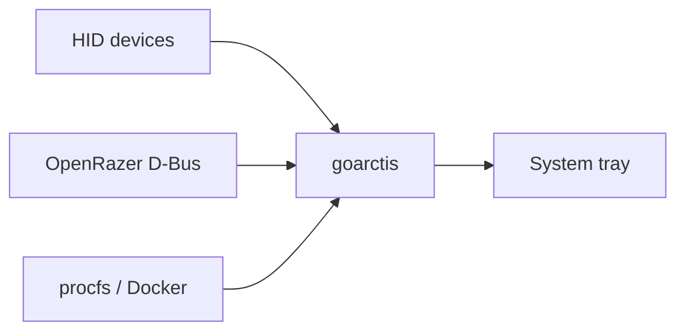

## What it is

A Linux system tray application that surfaces battery levels and system metrics for wireless peripherals. Built in Go, it pulls live data from three sources:

- HID devices: the standard USB interface most keyboards, mice, and headsets speak, which exposes raw reports the app can parse for battery state
- OpenRazer over D-Bus: a community driver for Razer peripherals on Linux that exposes device data over D-Bus, the Linux IPC system that desktop apps use to talk to system services
- procfs: the virtual filesystem at `/proc` that the Linux kernel uses to expose process and system info as readable files, useful for things like CPU and memory stats

Go is a good fit here: it compiles to a single binary with no runtime dependencies, which makes distribution extremely easy. It also allows for very simple `goarctis --self-update` functionality, where the app can check its GitHub releases for a new version and replace itself without needing a package manager or manual download.

## What it does

- Monitors battery levels for configured devices via HID (GameBuds, HyperX) and OpenRazer D-Bus (Razer mice)
- Renders a tray UI with per-device levels and a refresh loop to keep them current
- Surfaces optional host metrics: Docker container counts, CPU, and memory from procfs (hidden with `--disable-system`)

## Why I built it

Wireless peripherals notoriously lack first-class support on Linux. I have a handful of devices from HyperX, Razer, and SteelSeries that either ship no Linux software at all or require clunky workarounds to expose basic things like battery state.

Rolling my own tray app was a fun way to solve the problem on my own terms, dig deeper into Go and Linux internals, and tack on a few extra metrics I find useful day to day.

## Tech stack

| Piece        | Detail                                   |
| ------------ | ---------------------------------------- |
| Language     | Go                                       |
| UI           | GTK3, Ayatana AppIndicator               |
| Integrations | HID, OpenRazer D-Bus, Docker API, procfs |
| Distribution | GitHub Releases                          |
