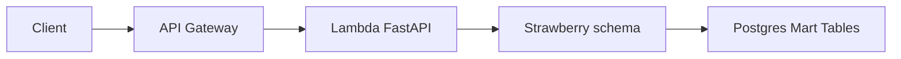

## What it is

A read-only GraphQL layer over the NBA Project mart tables, deployed as a serverless API on an AWS Lambda Function URL. It predated the current REST API and was retired in August 2022 once REST proved to be a better fit for my use case.

## What it does

GraphQL lets clients query for exactly the data they need, in contrast to REST where the response shape is fixed by the endpoint. This API:

- Exposed gold-layer tables through [Strawberry](https://strawberry.rocks/) GraphQL types
- Served queries via FastAPI on Lambda behind API Gateway and CloudFront, all managed in Terraform
- Documented example queries in the repo for league, team, and game data
- Shared the same database and transformation pipeline as the [NBA ELT platform](https://doqs.jyablonski.dev/architecture/nba_project/)

## Why I built it

At my first role as a Data Analyst, I'd worked with GraphQL APIs as a consumer and wanted to understand what building one looked like from the other side. The NBA Project data was a natural candidate since it has multiple potential clients with different data needs.

I also wanted to experiment with AWS Lambda Function URLs, which were a [new feature](https://aws.amazon.com/blogs/aws/announcing-aws-lambda-function-urls-built-in-https-endpoints-for-single-function-microservices/) at the time.

## Tech stack

| Piece  | Tool                        |
| ------ | --------------------------- |
| API    | FastAPI, Strawberry GraphQL |
| Data   | PostgreSQL (NBA ELT marts)  |
| Deploy | AWS Lambda, Terraform       |

## What I learned

- GraphQL earns its complexity when you have multiple clients with genuinely different data needs. Without that, the flexibility is overhead you pay for but rarely use.
- REST won for this project: caching, tooling, and client simplicity mattered more than ad-hoc query trees.
- Shipping GraphQL first wasn't wasted work. It taught me what to avoid in the REST API that replaced it, and made the second design noticeably better. And now I have the experience of building both, which is valuable in itself.
