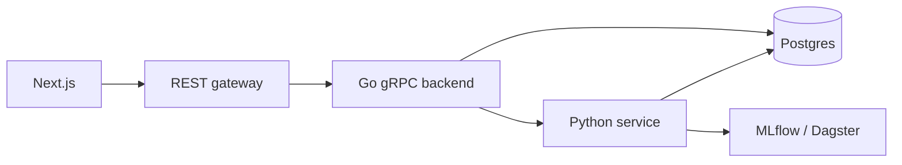

## What it is

A full-stack journaling monorepo. Users write entries, and backend services enrich them with topics and sentiment via ML and LLMs. It's a deliberate learning lab for microservices, observability, and MLOps, not a shipped consumer product.

## What it does

- Frontend (Next.js): CRUD for journal entries, auth flows, metrics endpoint
- Backend (Go gRPC + REST gateway): entry storage and the API surface the UI talks to
- Analyzer (Python): classification and sentiment pipelines
- Dagster + dbt: orchestration and transformation for analysis and user insights
- Django admin: database migration tooling and an admin UI
- Local platform: Docker Compose and [Tilt](https://tilt.dev/) for one-command dev with Postgres, Redis, Jaeger, Prometheus, Grafana, MLflow, and the Dagster UI

## Why I built it

After years of mostly data work, I wanted more full-stack reps and a project where I could experiment with ML and LLM features. A journaling app turned out to be a good fit: the data is structured enough to model, varied enough to make sentiment and topic classification interesting, and personal enough that I'd actually use it.

Structuring it as a monorepo with clear service boundaries also gave me a place to learn microservices and orchestration patterns without juggling separate repos.

## Tech stack

| Area          | Tools                                |
| ------------- | ------------------------------------ |
| Frontend      | Next.js, TypeScript                  |
| Backend       | Go, gRPC, REST gateway               |
| Analyzer      | Python, ML / LLM integrations        |
| Databases     | PostgreSQL, Redis                    |
| Orchestration | Dagster, Tilt for local dev          |
| Observability | Jaeger, Prometheus, Grafana          |
| CI            | Per-service GitHub Actions workflows |

## What I learned

- Monorepos pay off for projects like this. Dependency management, code sharing, and cross-service refactors get a lot simpler, at the cost of some up-front tooling and CI complexity. They're now my preferred structure for multi-service work.
- Tilt is a game changer for local iteration when multiple services and infra components run together. You're still using Docker, but Tilt's live updates and unified log dashboard significantly speed up the feedback loop.
- LLM APIs make it cheap to prototype features that would be a slog to build with traditional ML, but the tradeoffs (latency, cost, determinism, eval) have to be managed deliberately rather than waved away.
- Writing frontend code is still miserable.
