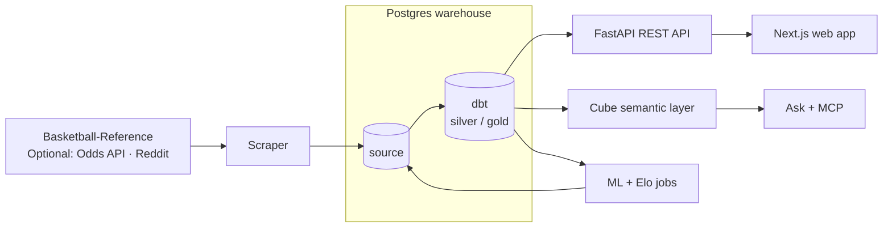

## What it is

[Baseline](https://baseline.jyablonski.dev) is a full-stack NBA analytics platform that combines data collection, a Postgres warehouse, predictive modeling, APIs, AI tools, and a public web app in a single monorepo. It is the v2 evolution of the NBA ELT project I've been hosting in different forms since 2021.

The platform includes multiple components for data ingestion, transformation, modeling, API serving, semantic layer, AI tools, and web presentation to serve enriched analytics and insights to users.

## What it does

- Scrapes Basketball-Reference for players, teams, schedules, games, box scores, play-by-play, standings, contracts, injuries, and transactions, with optional Odds API and Reddit integrations
- Manages raw source tables with a migration tool called Alembic, then builds cleaned `silver` models and analytics-ready `gold` marts with dbt
- Serves players, teams, standings, schedules, game flow, social data, transactions, and player comparisons through a FastAPI REST API
- Provides a Next.js web app with pages for browsing players and teams, comparing players, exploring schedules and game flow, reading relevant Reddit social data, and asking bounded natural-language questions
- Uses Cube as a governed semantic layer for the Ask page and FastMCP tools, so both interfaces query named analytics operations instead of generating free-form SQL
- Scores upcoming games with a pregame Elo model and a logit challenger, keeping predictions in the warehouse for evaluation and future product work

## Why I built it

I've always been interested in sports and wanted to build out my own application for exploring and analyzing NBA data while honing my data skills.

The original project was intentionally split across several repositories while I learned data engineering, machine learning, AWS, and infrastructure. V2 was a chance to consolidate those pieces into a monorepo, replace the Dash dashboard with a more capable Next.js application, and build a cleaner product around the data instead of treating the dashboard as the finish line.

NBA data is a useful domain because it combines structured statistics with messy real-world sources. Contracts, injuries, transactions, play-by-play, standings, and social data all have different shapes and failure modes, which makes the project a good test bed for identity matching across source systems and handling messy data while working on something fun.

## What changed in v2

- Consolidated the scraper, database migrations, dbt project, ML jobs, API, frontend, Cube model, and MCP server into one repository
- Replaced the Dash frontend with a Next.js app focused on exploration: player and team profiles, comparisons, schedule, standings, game flow, social data, and more
- Added a Cube semantic layer so natural-language queries and external AI assistants share the same governed measures and dimensions
- Added a FastMCP server with tools for dynamically fetching data in my own harnesses (and in a future state: an external AI assistant in the app)
- Reworked and simplified deployment considerably to Docker Compose on a free-tier cloud VM.
- Expanded the warehouse with contracts, payroll, injuries, transactions, play-by-play, game flow, social data, and model evaluation marts

## Tech stack

| Layer             | Tools                                    |
| ----------------- | ---------------------------------------- |
| Scraping          | Python, Click, BeautifulSoup, Requests   |
| Database          | PostgreSQL, SQLAlchemy, Alembic          |
| Transform         | dbt, staging/intermediate/gold models    |
| ML                | Python, Elo, logit challenger            |
| API               | FastAPI, Pydantic                        |
| Frontend          | Next.js, TypeScript, TanStack Query      |
| Semantic / AI     | Cube, FastMCP                            |
| Local development | Docker Compose, Tilt                     |
| Production        | Docker, Caddy, GitHub Actions, host cron |
