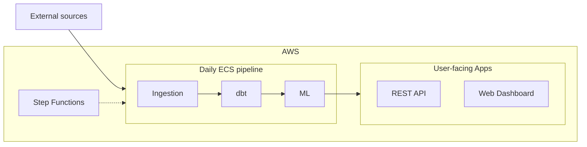

## What it is

A personal, production-grade data platform for NBA season analytics: daily ingestion, SQL transformations, ML win predictions, a public REST API, and an interactive web dashboard. Infrastructure is managed with Terraform on AWS, with Step Functions being used for pipeline orchestration for near-zero cost.

Full architecture write-up: [NBA Project on Doqs](https://doqs.jyablonski.dev/architecture/nba_project/).

## What it does

- Ingests raw data from basketball-reference, DraftKings, Reddit, and (historically) Twitter into Postgres bronze tables, with S3 backups for redundancy
- Transforms data through a medallion architecture (bronze → silver → gold) using dbt, with dbt-expectations for data quality testing
- Predicts daily game win probabilities with a logistic regression model using recent team performance, rest days, and active injuries as features
- Serves gold marts through a Lambda-hosted REST API ([api.jyablonski.dev](https://api.jyablonski.dev)) and a Dash frontend ([nbadashboard.jyablonski.dev](https://nbadashboard.jyablonski.dev))
- Runs daily on a single pipeline (ingestion → dbt → ML), with feature flags that control which sources get scraped based on the season schedule

## Why I built it

I wanted a real end-to-end analytics product, not a notebook or a single script, with scheduling, testing, IAM, and something I could show in interviews. NBA data was a fun domain with messy sources, including APIs that block AWS IPs and force custom scraping solutions. Keeping monthly spend around $1 on the AWS free tier made cost discipline part of the design from day one.

I've been hosting 24/7 in various forms since 2021, and it's evolved a lot over time. Initially I was focused on the data side and delivering a simple dashboard with valuable stats, but over time I started adding more features, like the Reddit scraping or ML predictions, new services like the REST API, and improving the infrastructure with Terraform, CI/CD, and real integration testing. It's been a great learning experience across the full stack of data engineering, machine learning, and cloud architecture.

## What I would do differently

The biggest thing I would change is to move to a monorepo. I wasn't familiar with these or the value of them when I started, and I structured the project as multiple separate repos for ingestion, dbt, ML, API, and dashboard. This works, but adds a lot of overhead and maintenance burden that's tricky to keep in sync. A monorepo with clear structure and tooling would make development smoother and significantly reduce the cognitive load of jumping between repos for related changes.

- I plan to make this change at some point when I start hosting the project in my homelab.

The other thing I'd want to do differently is figure out a better orchestration solution. Step Functions works to trigger the ECS jobs that make up the pipeline and it doesn't cost anything, but I'm very limited in how I can chain tasks together, get error alerting, or add small Python-based steps that don't need a full dedicated container.

- Airflow or Dagster are too expensive to self-host on cloud infrastructure for a personal project.
- Self-hosting Dagster in my homelab and making that swap around the same time I pivot the project to a monorepo would be a good opportunity, so knocking both of those problems out in one go could be a good move.

## Tech stack

| Layer       | Tools                                                                                |
| ----------- | ------------------------------------------------------------------------------------ |
| Ingestion   | Python, Pandas, SQLAlchemy                                                           |
| Transform   | dbt, dbt-expectations, Postgres                                                      |
| ML          | Python, scikit-learn                                                                 |
| API         | FastAPI, AWS Lambda, CloudFront                                                      |
| Dashboard   | Dash, Plotly                                                                         |
| Infra       | Terraform (custom modules), ECS Fargate, Step Functions, RDS, S3                     |
| Shared libs | [jyablonski_common_modules](https://github.com/jyablonski/jyablonski_common_modules) |

Related repos: [dbt](https://github.com/jyablonski/nba_elt_dbt), [ML](https://github.com/jyablonski/nba_elt_mlflow), [REST API](https://github.com/jyablonski/nba_elt_rest_api), [Dash](https://github.com/jyablonski/nba_elt_dashboard), [Terraform](https://github.com/jyablonski/aws_terraform).
